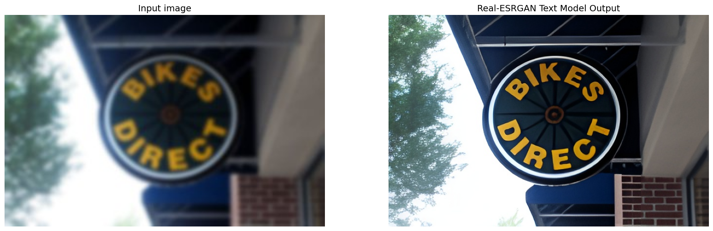
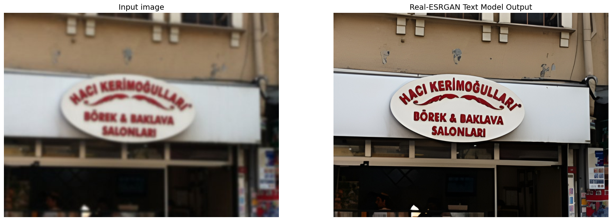
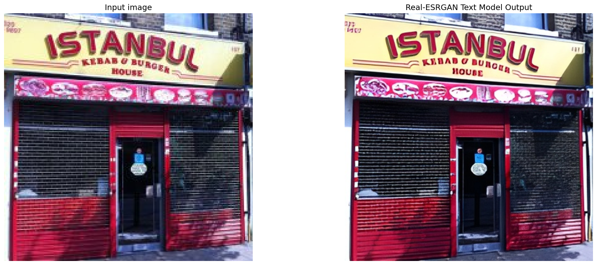

# Real-ESRGAN-Text-Model
Fine-tuned Real-ESRGAN ×2 model specialized for text-based images.
## Features

-  2× super-resolution for images containing printed or digital text  
-  Enhanced clarity and sharp edges for improved OCR and visual quality

## Examples

  

## Usage

You can use this model with the Real-ESRGAN inference script.

## Configuration

All training and inference parameters are defined in:

finetune_realesrgan_x2plus_text.yml
